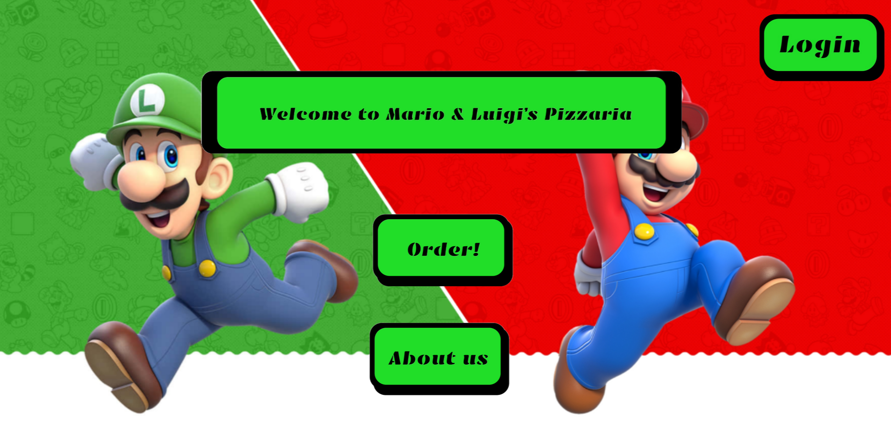

<h1 align="center">
   
  Mario & Luigis Pizzaria
   
</h1>

<h4 align="center">A simple webshop build with HTML, CSS and deployed through Flask. It also interacts with an arduino when an order is placed through a serial connection. </h4>

<!-- Horizontal short Menu (w\ Links) -->

  <a href="#key-features">Key Features</a> •
  <a href="#usage">Usage</a> •
  <a href="#credits">Credits</a>

<!-- Pref. Animated Screenshot-->

## Key Features

- Two ordering interfaces
- An automated oven timer with sound and light alarm (Arduino)
- Rudementary account system

## Usage

## Ordering as a Waiter

If the user was a waiter they would land on the dedicated waiter page

After adding all the items, they could review and submit the order

## Ordering as a Client

If the user was a Client, the would land on the Client page

And after reviewing their order would get an estimate of the cook time for the Pizzas. This of course did not represent a real estimate as we lacked the skills to implement complex behaviour like that at the time.

## Cooking as a Pizzaiolo

Cooks would automatically get a list of orders and their respective Pizzas to bake on his webpage

Additionaly, they could indicate when Pizzas were put in the oven and the server would automatically start a timer and alert the cook when the Pizzas were ready. This is also where the Arduino comes in, it had some functions like manually starting a timer based by selecting a pizza using its screen and a knob, as well as standart sound and light alarms that were automatically set based on the pizza type. If the Arduino is connected when the cook presses the button, it will start the timer and alert the cook when done.

## Accounting as an Owner

Finally, as an owner you could see the items sold and the money generated automatically on a different endpoint.

## Credits

This software uses the following open source packages:

- [Flask](https://flask.palletsprojects.com/en/stable/)
- [SQLAlchemy](https://www.sqlalchemy.org/)
- [WTForms](https://pypi.org/project/WTForms/)
- [SQLAlchemy](https://www.sqlalchemy.org/)

Created with the help of some Fontys students at [Fontys](https://www.fontys.nl/).

### My Links

> [neo-dev.org](https://neo-dev.org) &nbsp;&middot;&nbsp;
> GitHub [@N4fta](https://github.com/N4fta)
